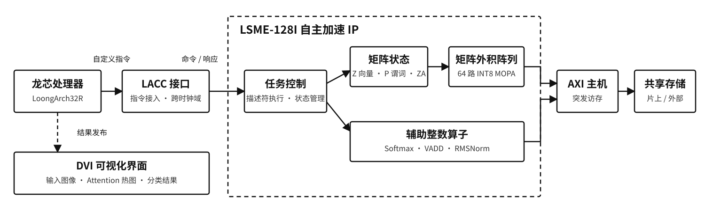

# LSME-128I TinyViT

面向 LoongArch32R 与 XC7A200T 的自主 INT8 AI 加速 IP。CPU 通过自定义 LACC
指令访问矩阵状态，再以描述符调度 TinyViT 的 GEMM、Softmax、向量残差等关键算子；
DVI 同步展示输入图像、注意力热图和分类结果。

## 设计重点

- **SME 启发的状态模型**：Z 向量、P 谓词与 ZA 二维累加状态，适配 INT8 推理。
- **64 路 INT8 MOPA**：以 4x4 外积为原子计算单元，支持尾块谓词屏蔽。
- **软硬件协同调度**：`EXEC/WAIT` 提交 64-byte 描述符，覆盖 GEMM、Softmax、VADD。
- **可解释演示**：同一推理过程同时生成 Attention 热图、十分类分数和 PASS 状态。

## 系统结构

## 代码入口

| 位置 | 内容 |
|---|---|
| `rtl/ip/lsme/` | 矩阵状态、MOPA、描述符执行器、AXI 与 CSR |
| `rtl/ip/open-la500/` | LoongArch 自定义 LACC 指令接入 |
| `sdk/software/examples/cifar_tinyvit_demo/` | TinyViT 软件调度与量化模型 |
| `rtl/ip/DVI/axi_dvi.v` | RGB332 输入、Attention 热图和分类仪表盘 |
| `sim/` | MOPA、GEMM、Softmax、CDC、AXI 与 SoC 仿真 |
| `fpga/` | Vivado 约束、综合和实现脚本 |

## 文档

- [架构概览](doc/architecture.md)
- [指令与描述符](doc/isa.md)
- [演示说明](doc/demo.md)
