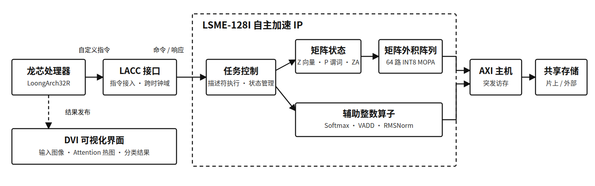

# 架构概览

LSME-128I 在 LoongArch32R CPU 与外部存储器之间增加一个面向 INT8 张量计算的
协处理器。设计借鉴 SME 的向量、谓词和二维累加状态，但只实现 FPGA 上可验证的
固定整数子集。

核心结构：

- **Z**：8 个 128-bit 向量寄存器，保存 INT8 操作数。
- **P**：4 个 16-bit 谓词寄存器，处理非整齐矩阵边界。
- **ZA**：4 个 4x4 S32 累加瓦片，保存外积累加结果。
- **MOPA**：64 路有符号 INT8 乘加阵列，完成一个 4x4x4 外积。
- **描述符执行器**：读取 64-byte 工作描述符，组织 GEMM、Softmax 和 VADD。
- **DVI 仪表盘**：显示当前输入、注意力、分类分数和预测状态。

该分层使低级矩阵状态可通过自定义指令观察，高级 AI 算子可通过描述符一次提交。
